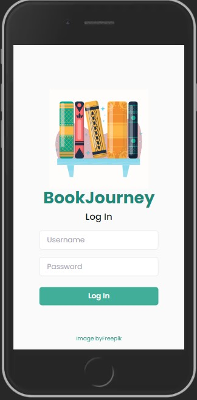
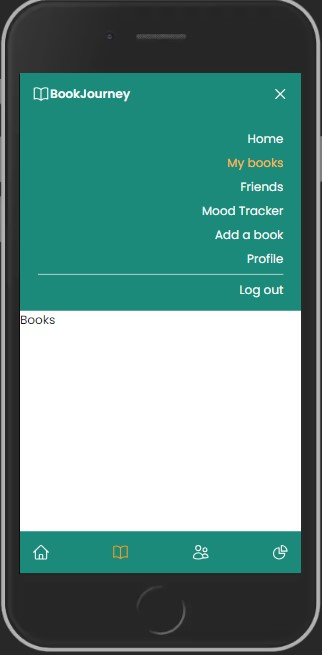

### (code under construction :hammer_and_wrench:)

# Book Journey

## Contents

- [Deployed app](#deployed-app)
- [Sign in](#sign-in)
- [Design](#design)
- [About](#about)
- [Technologies](#technologies)
- [Screenshots](#screenshots)

## Deployed app

<b> [Link to the deployed app](https://book-journey.netlify.app/) </b>  

## Sign in

To test the app you can log in with username:

        booktester

and password:

        ilovebooks

or create a new account

## Design

[Link - figma design](https://www.figma.com/file/d8aWbn9I5lcGr7qO8B5z7x/BookJourney?type=design&node-id=0%3A1&mode=design&t=rlcY1RJpIIzhIX5b-1)

## Project description

:handshake: project collaboration  
I'm building frontend for the REST API (Java)  
[Link to the backend repo](https://github.com/JuliaSawczenko/BookJourney)  
[Link to the endpoints](https://book-journey-app-54dba2b08eec.herokuapp.com/swagger-ui/index.html)

Planned features:
- app for tracking info about books you want to read and already have read
- you can add a book to one of three categories (reading, to read, read)
- for each book you have read, you can add reviews and moods and track your mood statistics
- you can also recommend books to your friends

Completed features:
- logging in and creating account (Yup validation, displaying errors)
- adding books to one of three categories (read, reading, to read)
- book detail pages - displaying data added by user (status, rate, start and end date, moods, review) and info from Google Books API (categories, description, average rating)
- editing books and changing shelves
- adding and editing moods, which are displayed on a chart
- search component (results from Google Books API) - adding book from search results
- add a book - adding your own books
- adding to favourites
- change userdata and password
- pagination (search results, book lists)
- dashboard - reading now slider with 'add a mood' button (opens a modal)

## Technologies

- React, React Router, TailwindCSS
  
  
  
- additional packages: Vite, Formik & Yup, <a href="https://www.npmjs.com/package/react-datepicker">react-datepicker</a>,  <a href="https://www.npmjs.com/package/react-chartjs-2">react-chartjs-2</a>,  <a href="https://react-slick.neostack.com/" >react-slick</a>, <a href="https://www.npmjs.com/package/react-paginate" >react-paginate</a>, <a href="https://github.com/tailwindlabs/heroicons" >heroicons</a>, <a href="https://www.npmjs.com/package/react-toastify" >React-Toastify</a>

## Screenshots:

 
 
 
